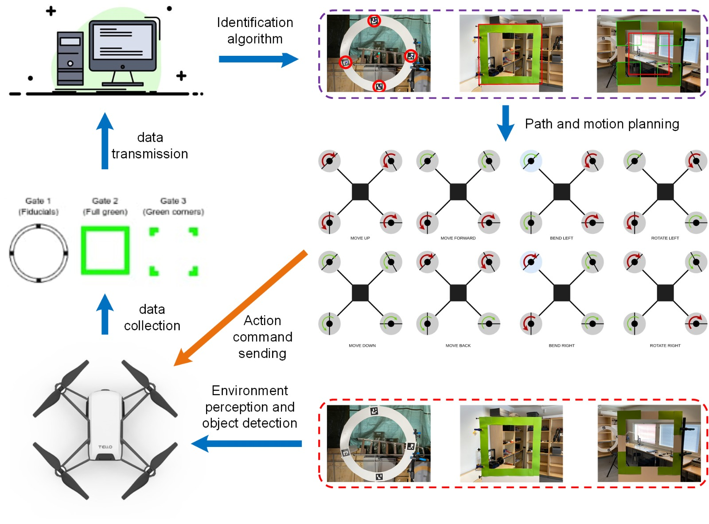

# Introduction
This is the common project of the course "Robotics and Autonomous Systems(2022)" in University of Turku. The main task of this project is to make the tello pass 3 diffirent gates automatically. The principle is shown below.

## Gate 1
Gate 1 includes 4 arcuo codes, we need to decect all the arcuo codes and calculate the position of the center of 4 arcuo codes. By some calculation, we can gat the center point of the Gate 1, and then compare it with the center point of the image frame of the drone. According to the diffirence of two center points, planning the path and motion and controling the drone automatically.
## Gate 2
Gate 2 is a full green rectangle, we first extract the green components of the image frame, and then use edge detection to get the max green rectangle. Similarly, calculate 2 center points and do path and motion planing.
## Gate 3
Gate 3 includes 4 green corners, similar with Gate 2, we extract the green components and detect 4 largest rectangle edges.
# How to use
## Run the main code
```
python3 multithreading.py
```
### Detection algorithm of Gate1
```
from img_process import gate1
```
### Detection algorithm of Gate2
```
from img_process import gate2
```
### Detection algorithm of Gate3
```
from img_process import gate3
```
| WMR Model (WASD Control)                                                     | WMR PID                                                                               | WMR Pure Pursuit                                                                                        |
| ---------------------------------------------------------------------------- | ------------------------------------------------------------------------------------- | ------------------------------------------------------------------------------------------------------- |
| [](lab1/program/wmr_model.py) | [](lab1/program/PathTracking/wmr_pid.py) | [](lab1/program/PathTracking/wmr_pure_pursuit.py) |

| Bicycle Model (WASD Control)                                                         | Bicycle Pure Pursuit                                                                                            | Bicycle Stanley                                                                                       |
| ------------------------------------------------------------------------------------ | --------------------------------------------------------------------------------------------------------------- | ----------------------------------------------------------------------------------------------------- |
| [](lab1/program/bicycle_model.py) | [](lab1/program/PathTracking/bicycle_pure_pursuit.py) | [](lab1/program/PathTracking/bicycle_stanley.py) |
